# Ecommerce Store

This project aims to create a feature-rich mobile app that offers a seamless and delightful shopping experience. This
app will empower users to browse products, manage their shopping carts, personalize their profiles, and much more.
Below, you'll find an overview of the key features and tasks that will make this app a reality.

## Prerequisites

Before running the app, ensure you have the following prerequisites installed on your development machine:

* Node.js: Visit [Node.js official website](https://nodejs.org/en) and download the latest LTS version.
* npm (Node Package Manager): npm is included with Node.js. You can verify its installation by running npm -v in your
  terminal.
* Yarn (optional but recommended): Yarn is a faster and more efficient package manager. You can install it by following
  the instructions on the [Yarn website](https://yarnpkg.com/).

## Installation

To get started with the project, clone the repository and install the necessary dependencies:

```bash
  git clone https://github.com/kristina-salnyk/ReactNativeCourseHW.git
  cd ReactNativeCourseHW
  npm install or yarn install
```

## Environment Variables

To run this project, you will need to add the following environment variables to your .env.development, .env.staging and
.env.production files:

`ENV=<development>`

`REACT_APP_GOOGLE_API_KEY=<Your_API_KEY>`

`REACT_APP_APP_CENTER_KEY_IOS=<Your_SECRET_KEY>`

`REACT_APP_APP_CENTER_KEY_ANDROID=<Your_SECRET_KEY>`

`REACT_APP_STORYBOOK_ENABLED=false`

## Running

Now that you have the project and its dependencies installed, you can start the app:

### iOS

1. To run the app on an iOS simulator, make sure you have Xcode installed on your macOS machine.
2. Open a terminal window and navigate to the project directory:

```bash
  cd ReactNativeCourseHW
```

3. Run the following command to start the app on the iOS simulator:

```bash
  npm run ios
```

This command will build the app and launch it on the default iOS simulator.

### Android

1. To run the app on an Android emulator or device, make sure you have Android Studio and an emulator set up. You can
   follow the instructions in the [React Native documentation](https://reactnative.dev/docs/environment-setup) for
   setting up the Android development environment.
2. Open a terminal window and navigate to the project directory:

```bash
  cd ReactNativeCourseHW
```

3. Run the following command to start the app on the Android emulator or device:

```bash
  npm run abdroid
```

This command will build the app and launch it on the default Android emulator or the connected device.

### Running on Physical Device

If you want to run the app on a physical iOS or Android device, you'll need to follow additional steps. Please refer to
the [React Native documentation](https://reactnative.dev/docs/running-on-device) for detailed instructions on running
the app on physical devices.

With these steps completed, you should have the Ecommerce Store App up and running on your preferred platform. Enjoy
exploring the app's features and functionalities!

## Features

This project was built using React Native CLI, TypeScript, [Styled Components](https://styled-components.com/),
and [React Native Testing Library](https://callstack.github.io/react-native-testing-library/),
harnessing the power of these technologies to create a robust and visually appealing mobile app. The app's features and
functionalities are listed below:

**User-Centric Interface**: Created a visually appealing and intuitive interface that enhances the user experience.

- **Main Screen**

  The main screen has been designed based on meticulous mockup designs, prioritizing aesthetics and ease of use.


- **Product Details Screen**

  The product details screen has been crafted to offer a rich and informative experience to users.

**Seamless Data Integration**: The app is built on a foundation of seamless data integration to provide users with the
most up-to-date product information.

- **API Integration**

  The application has been seamlessly integrated with the [Spree Ecommerce API](https://api.spreecommerce.org/),
  ensuring that users have access to real-time data.

**Intuitive Navigation**: Implemented intuitive navigation to help users effortlessly explore the app.

- The app features smooth transitions between screens, courtesy of React Navigation.


- A convenient Drawer navigation menu and a user-friendly entry point have been created to enhance navigation.

**User-Centric Shopping Cart**: Shopping cart functionality is prioritized, ensuring a convenient and efficient shopping
process.

- **My Cart Screens**

  All aspects of the cart, including empty and populated states, have been meticulously designed for a cohesive
  experience.

**Social Sharing** : Integrated a powerful contact and sharing mechanism into the app. Users can effortlessly share this
app via social media, helping to reach a broader audience.

**User Profile Management**: Personalization is key, and this app offers a feature-rich user profile management system.

- **My Profile Screen**

  Users can manage their profiles with ease, including editing, saving, and retrieving profile information. Logout
  functionality is seamless and user-friendly.


- **Profile Picture Editing**

  Users can update their profile pictures by choosing images from their gallery or capturing a photo from the camera.

**Efficient Product Search**: Streamlined the product search process to help users find what they're looking for
quickly.

- **Product Search**

  A search bar on the main screen allows users to initiate searches with ease.

**Interactive Maps**: The app includes interactive map functionality for shipping addresses.

- **Shipping Address on the Map**

  The order details screen incorporates a dynamic map that displays shipping addresses. Users can easily visualize their
  shipping destinations.

**Analytics and Testing**: Data analysis and testing are seriously connected to ensure a robust and reliable app.

- **Crash Reporting and Analytics**

  Crash reporting and analytics tools from AppCenter have been integrated to help monitor and optimize the app's
  performance.

  Event tracking is added for each screen, providing valuable insights into user interactions.


- **UI Testing**

  UI tests are written using
  the [React Native Testing Library](https://callstack.github.io/react-native-testing-library/) to maintain a high level
  of app quality.

**Storybook Integration**: Integrated the Storybook tool to streamline UI development and testing.

**Build Management**: This project is well-organized and configured for efficient build management.

- **Build Flavors**

  Created distinct 'development,' 'staging,' and 'production' flavors for the application.

**Code Quality**: Implemented measures to maintain code quality and consistency.

- ESLint enforces code style and best practices throughout the project.


- Prettier is configured to automatically format code, ensuring consistency and readability.


- Husky ensures that linting and unit tests run before each commit, guaranteeing code quality.

## Screenshots

<div style='display: flex;'>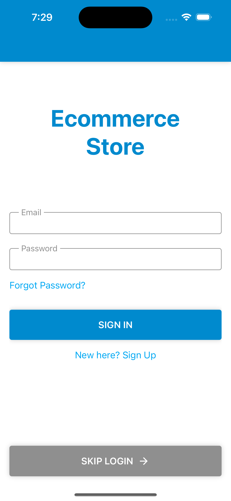
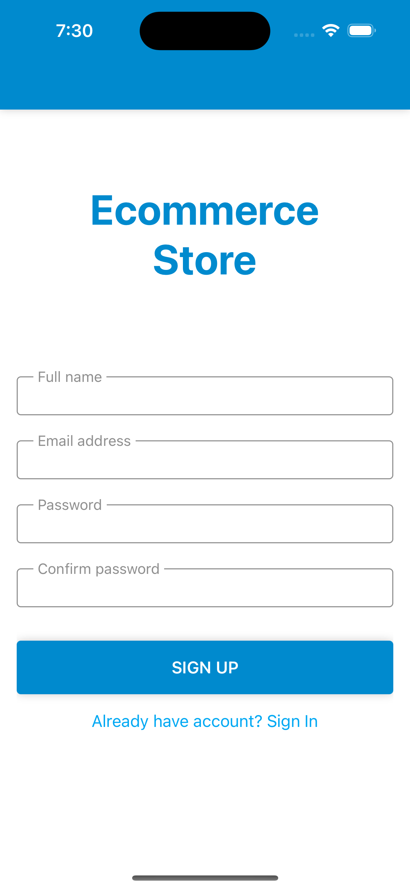
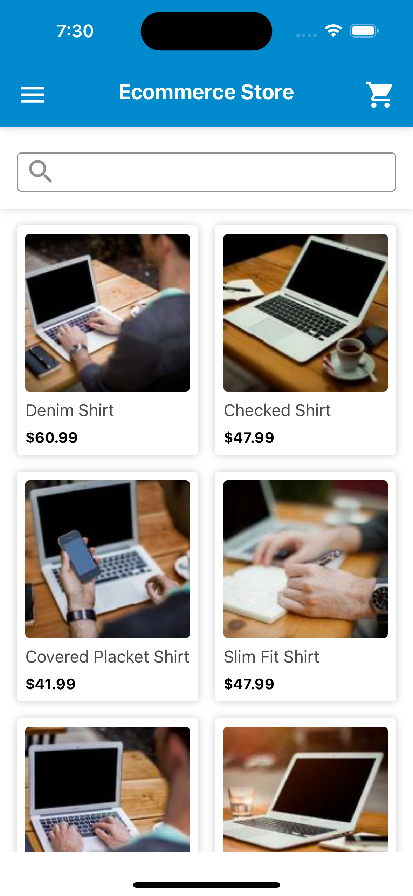
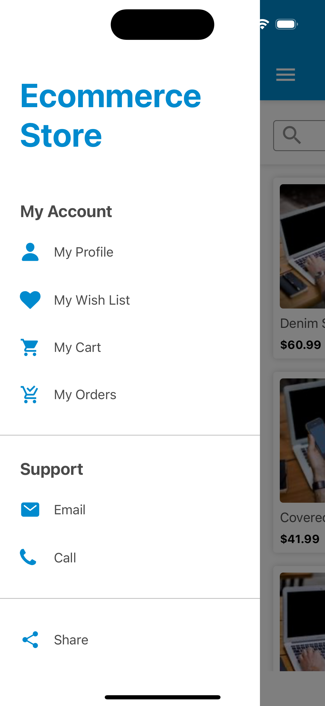
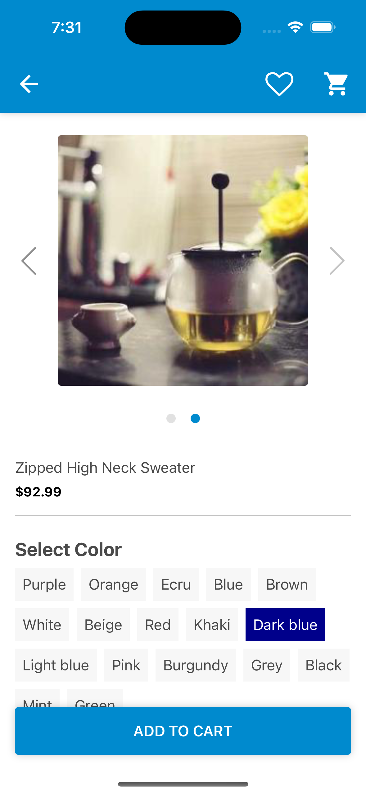
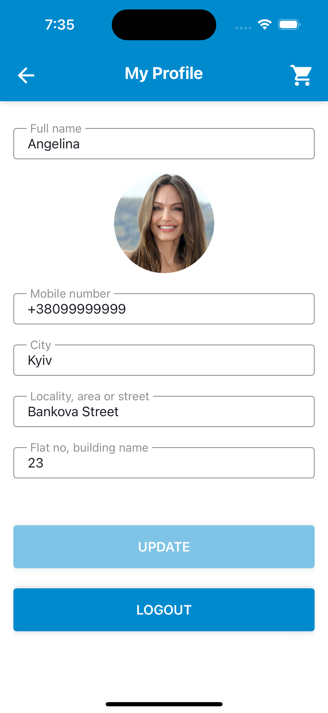
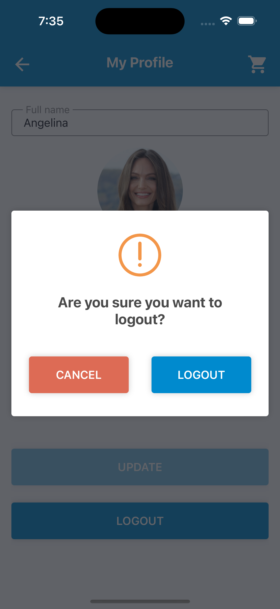
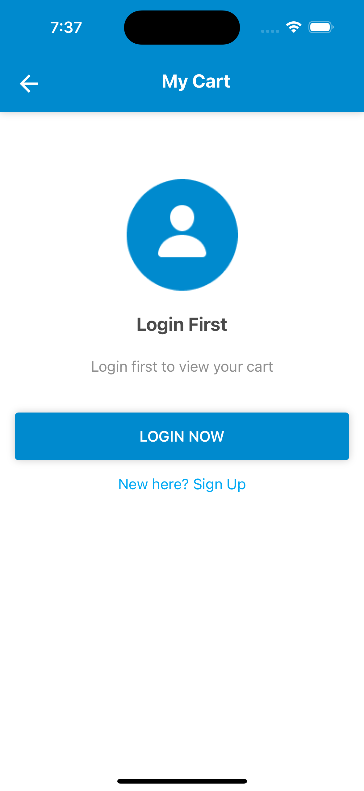
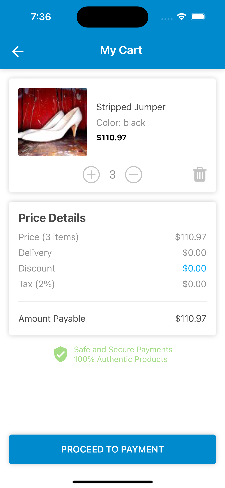
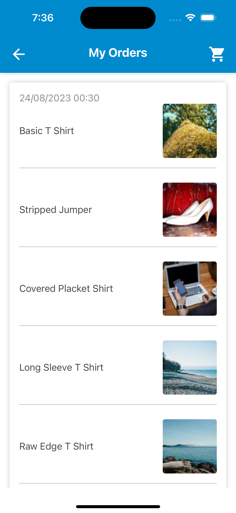
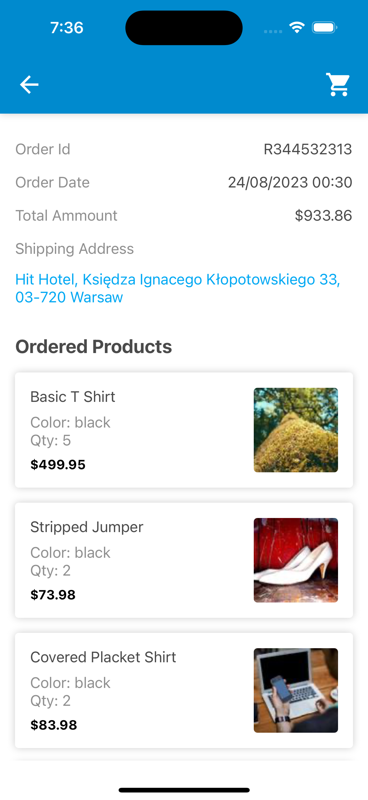
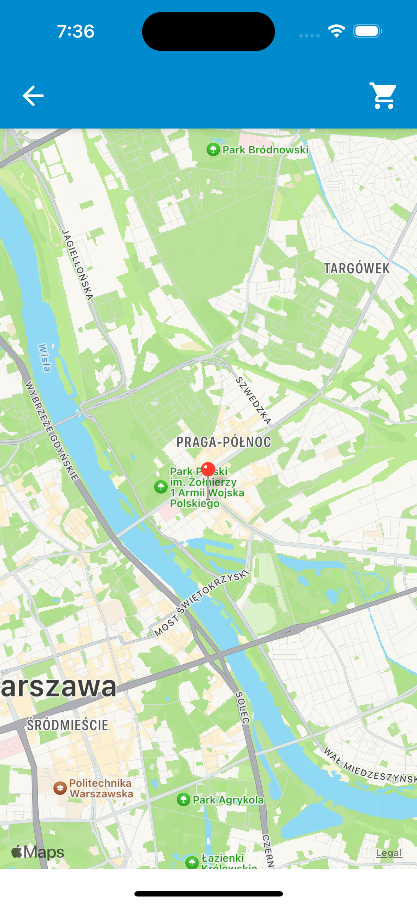
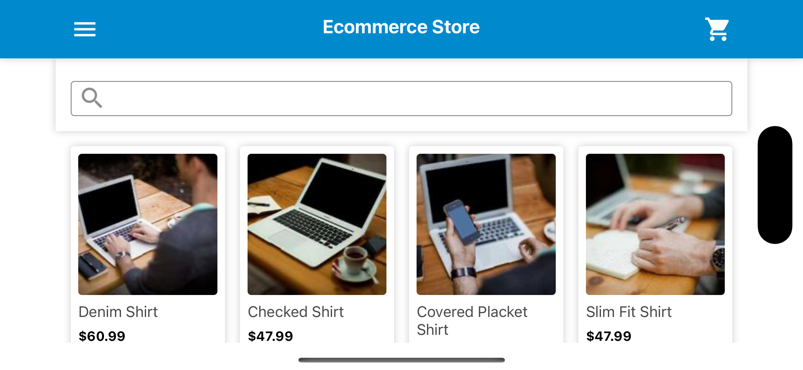</div>

## Deployment

The Commerce Store App is deployed, and ready for distribution on Android, and you can access it on AppCenter's Public
page. Follow the link below to install the app and experience its rich features:

[Install Mobile Store App for Android](https://install.appcenter.ms/users/kristinasalnyk/apps/ecommerce-store-1/distribution_groups/production)

By clicking on the link above, you'll be able to download and install the Commerce Store App on your Android device,
giving you access to a seamless and delightful shopping experience. We appreciate your interest in our project and look
forward to your feedback as we continue to enhance and optimize the app. Thank you for being a part of the journey!

